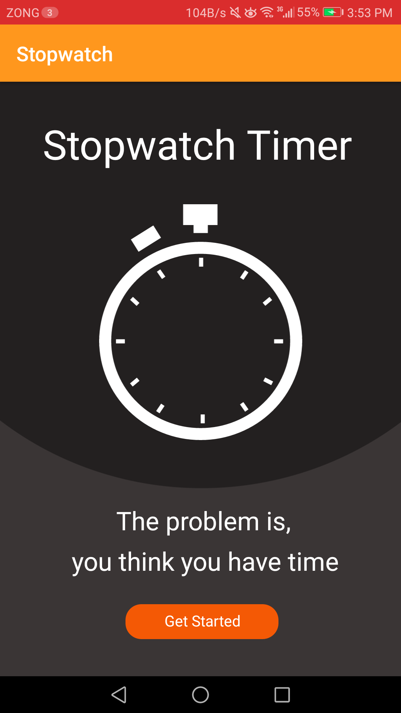
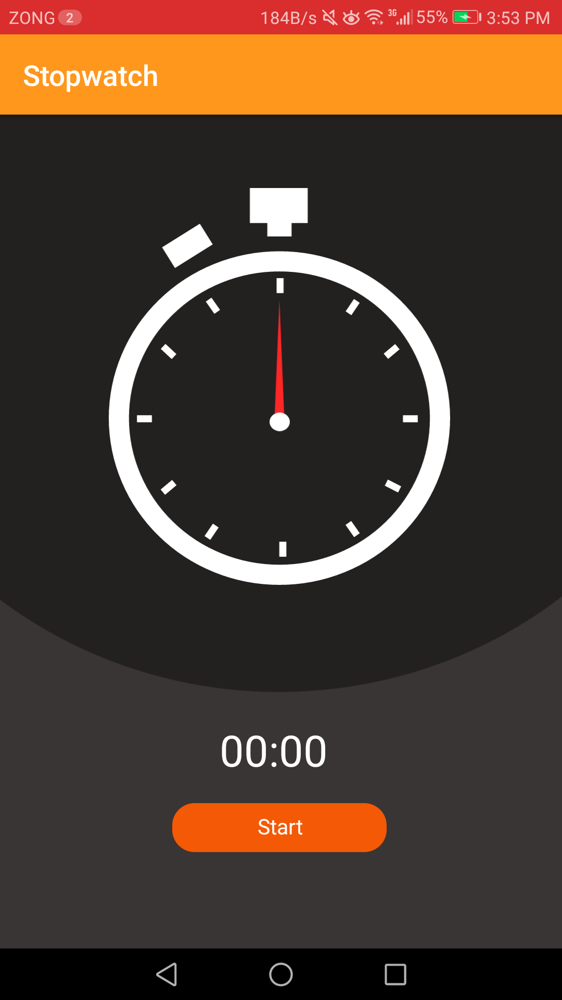
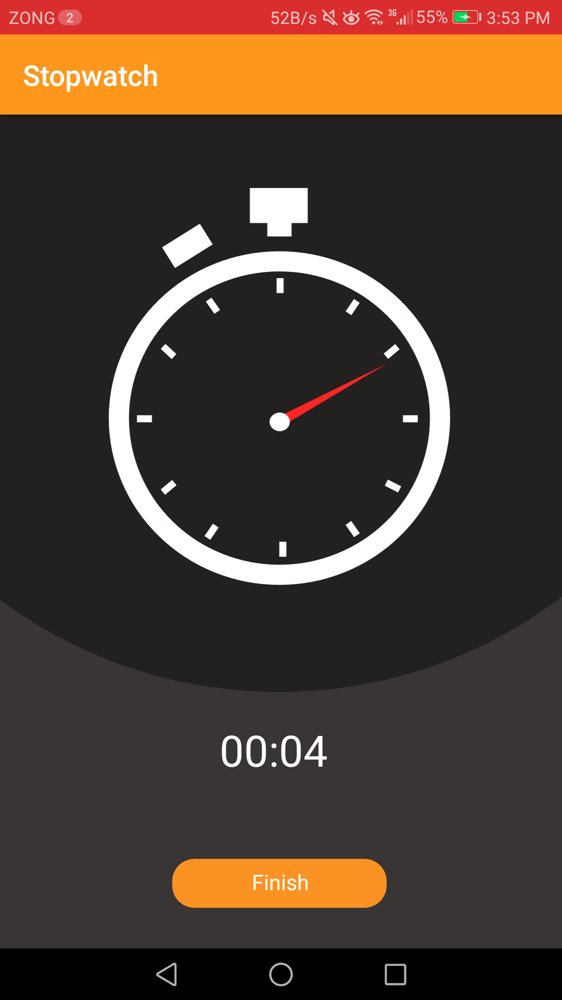
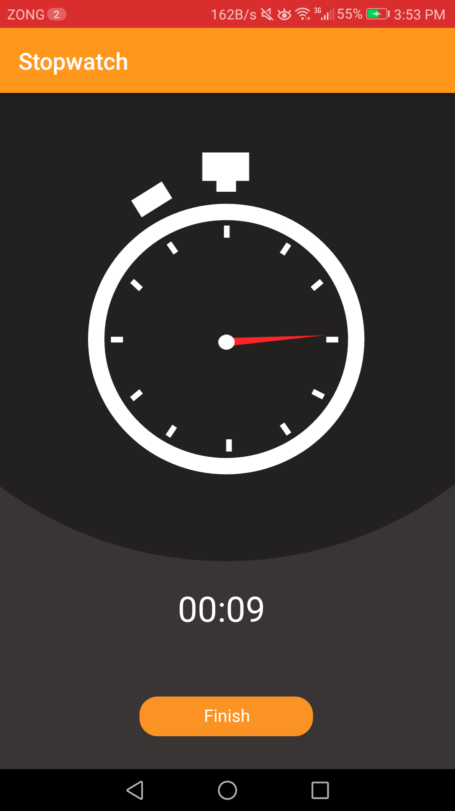
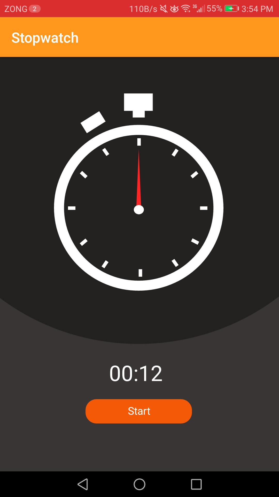

# Stopwatch
 
 <h2>About</h2>
An android application of a stopwatch timer which is simple, easy and accurate that will help user to measure time of any situation like education, gaming, cooking, sports etc. User can start and stop the stopwatch by pressing the button in center of screen and can see the elapsed time. 

<h2>Screenshots</h2>

 
 
 
 
  

